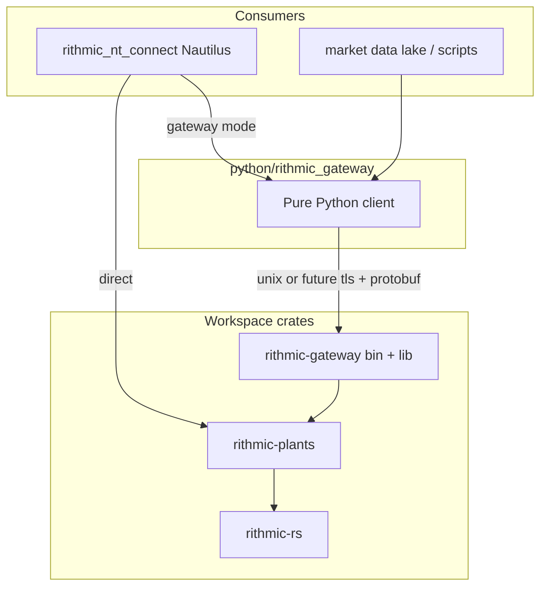
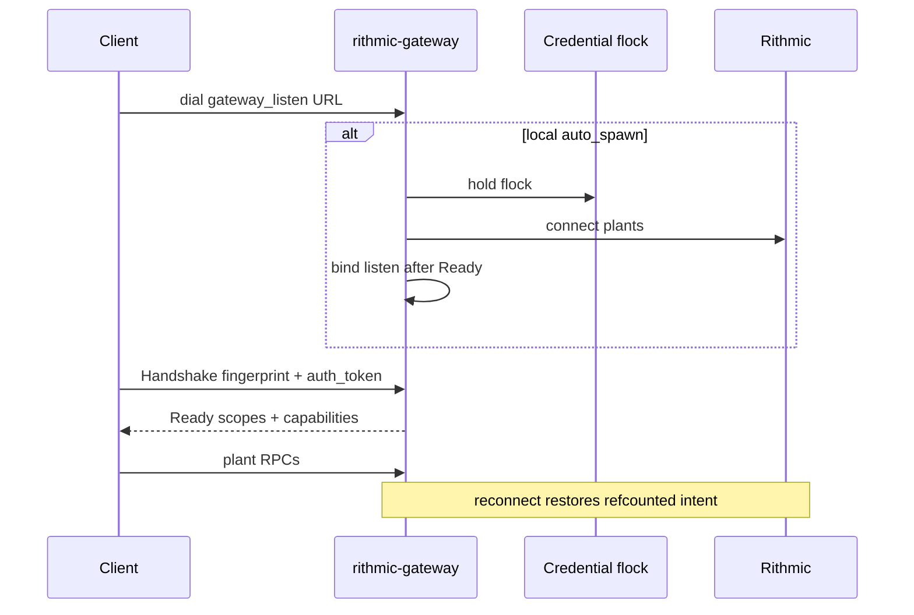

# feat: Cross-process Rithmic session gateway

## Goal Capsule

**Objective.** Ship a **reusable session broker** (one Rithmic login per credentials) that multiple toolkits can share — Nautilus adapter, market-data lake, scripts — via a transport-agnostic semantic protobuf API. Preserve today's in-process **direct** path as the default for single-process Nautilus work.

**Authority.** `AGENTS.md` single-login + trading gates; `docs/STATUS.md` honesty; plant-semantic IPC (not Nautilus types) as the shared contract.

**Stop conditions.** Do not mirror R|Protocol or fake R|Trader Pro. Do not commit gated Rithmic protos. Do not put broker logic only inside the Nautilus PyO3 module. Do not make lake/tools depend on Nautilus to share a login. Do not attempt a second Rithmic login when the credential flock is held. Parent reconnects Rithmic; children do not open plants. No plaintext remote listen in v1.

---

## Product Contract

### Summary

**Architecture (same monorepo):**

| Package | Role |
| --- | --- |
| `crates/rithmic-plants` | Shared plant session façade over `rithmic-rs` (session, plants, history helpers, DTOs) |
| `crates/rithmic-gateway` | Broker: flock, listen, fan-out, reconnect, `rithmic-gateway` **bin** |
| `python/rithmic_gateway` | **Pure Python** client (protobuf + stream); no maturin required for lake/scripts |
| `crates/rithmic-nt-connect` + `python/rithmic_nt_connect` | Nautilus adapter; direct PyO3 **or** wraps `rithmic_gateway` client |

**Ways of work:**

1. **Direct (default)** — process takes credential flock, owns plants via PyO3/`rithmic-plants` (today’s TradingNode path).
2. **Gateway** — only the gateway **bin** owns Rithmic; clients use `listen` URL (v1: `unix://…`). Auto-spawn optional. Parent reconnects Rithmic and restores refcounted intent.

**Remote (architected now, shipped later):** same protobuf + Handshake auth fields; v1.5 = localhost + SSH/WG tunnel (docs); v2 = `tls://` + token scopes for Docker/VPS.

### Requirements

- R1. Direct mode remains default; TradingNode data+exec and existing scripts keep working when gateway is off.
- R2. Gateway mode: one parent Rithmic login; clients never open plants for that credential set while using the gateway.
- R3. IPC is **plant-semantic** length-delimited protobuf (subscribe/load/place/events) — **not** R|Protocol and **not** Nautilus `TradeTick`/`InstrumentId`. Codec is **transport-agnostic** (works on unix or future tcp/tls byte streams).
- R4. V1 broker exposes full plants: MD, history, PnL, lazy order — with **parent-side** trading / `cancel_all` gates.
- R5. Auto-spawn (when enabled and bin resolvable) starts exactly one parent; client waits Handshake **Ready** (plants up), not mere accept.
- R6. Configurable: `session_mode`, **`gateway_listen` URL** (not socket-path-only), auto-spawn, token (optional in v1). Defaults: direct; unix listen under XDG/runtime; auto-spawn when bin found.
- R7. Multi-client fan-out with refcounted venue subs; no shared single-consumer poll.
- R8. No secrets in argv, logs, `repr`, errors, or protobuf payloads (password never on wire). Handshake = fingerprint + **auth token field** (may be empty for local v1).
- R9. Docs: dual modes, flock UX, reconnect, same-UID local trust, MotiveWave still manual; remote tunnel recipe (v1.5).
- R10. Shared credential **flock** (`user+system+url`) before any Rithmic connect for **direct and gateway parent**; refuse with clear local error; stale-lock recovery.
- R11. Gateway parent reconnects Rithmic on plant drop and restores refcounted intent; clients keep broker connections (or reconnect to broker only).
- R12. Client disconnect = detach + refcount only while peers remain.
- R13. Bounded per-client queues; overflow disconnects that client only.
- R14. Broker is a **separate workspace crate + Python package**; Nautilus adapter is one consumer. Lake/other tools can depend on `rithmic_gateway` without Nautilus.
- R15. Handshake/Ready include **capability/auth hooks** from day one (token + advertised scopes) so remote TLS does not require a protocol break. v1 local may accept empty token when peer is same-UID unix; v2 requires token (and TLS) for non-local listen.

### Actors

- A1. Nautilus / sandbox operator
- A2. Second local process (backtest, smoke, notebook) via gateway client
- A3. Gateway parent (`rithmic-gateway` bin)
- A4. Future remote consumer (Docker/VPS / lake) — same client API, different listen URL + auth

### Key Flows

- F1. Direct: flock → plants connect → use session.
- F2. Gateway attach: resolve listen URL → connect stream → Handshake → Ready → RPCs/events.
- F3. Auto-spawn (local unix only): no listener → flock/spawn bin → wait Ready → F2.
- F4. Multi-client MD fan-out.
- F5. Orders only if parent trading enabled; post-send IPC failure stays unknown/in-flight at Nautilus boundary.
- F6. Parent Rithmic reconnect + intent restore.
- F7. Flock refuse for second direct/parent.
- F8. *(v1.5 docs)* Remote via SSH/WG to localhost listen — no protocol change.
- F9. *(v2)* Remote `tls://host:port` + non-empty token + scopes.

### Acceptance Examples

- AE1. Direct sandbox works as today.
- AE2. Gateway + auto-spawn Ready + ticks (mocked). Live Lucid multi-process no ForcedLogout before STATUS > Partial.
- AE3. Two clients both receive last-trade for same symbol.
- AE4. `cancel_all` denied unless parent config enables; clients cannot elevate.
- AE5. Nautilus still injects `WireSession` (adapter wraps plant client).
- AE6. Flock refuse: direct fails locally while gateway holds lock.
- AE7. Parent plant drop → reconnect → events resume without clients opening Rithmic.
- AE8. Framing round-trip works against a byte-stream mock (transport-agnostic).
- AE9. Handshake schema includes `auth_token` (and Ready advertises scopes); empty token accepted only on local unix v1 policy.

### Scope Boundaries

**In scope (v1)**

- Workspace: `rithmic-plants`, `rithmic-gateway`, `python/rithmic_gateway`, nt-connect wiring
- Unix listen + transport-agnostic protobuf + auth/capability **fields**
- Flock, fan-out, reconnect, parent gates, auto-spawn
- Adapter dual mode + docs (including tunnel-based remote recipe)
- Unit tests + Lucid smoke bar for STATUS

**Deferred to Follow-Up Work (v1.5 / v2)**

- Native `tcp`/`tls` listen implementation + Docker Compose example (v2)
- Mandatory token + capability enforcement for non-local (v2)
- mTLS, multi-account parent, rate limits
- R|Trader Pro plugins, R|Protocol mirror, shared-memory rings
- Separate git publish of gateway (when lake needs out-of-tree package)
- Account auto-discovery polish (other plan)

**Outside this product's identity**

- Official in-tree Nautilus adapter
- Gated Rithmic protos in git
- Forcing lake to depend on Nautilus

---

## Planning Contract

### Key Technical Decisions

- KTD1. Dual backends at Nautilus seam (session-settled: user-directed): `direct` = PyO3 plants; `gateway` = `rithmic_gateway` Python client implementing adapter `WireSession` by adapting plant-semantic events → existing dict shapes.
- KTD2. Plant-semantic protobuf IPC (session-settled: user-directed — not R|Protocol mirror): shared by all toolkits; Nautilus convert stays in nt-connect.
- KTD3. **Transport-agnostic framing** + **`gateway_listen` URL** (session-settled: architecture): v1 implements `unix://` only (`0600`, XDG preferred). Code paths take `AsyncRead + AsyncWrite` (or equivalent), not “UDS-only types,” so tcp/tls plug in later without rewriting RPCs.
- KTD4. Full plant surface in v1 (session-settled: user-directed) behind milestones: MD fan-out → history chunks → order/PnL + gates.
- KTD5. Auto-spawn + flock before Rithmic connect; listen only after plants up; Ready = plants connected (session-settled: user-directed).
- KTD6. **Workspace split** (session-settled: user-directed — chosen over broker-inside-nt-connect): `rithmic-gateway` crate + bin; pure Python `rithmic_gateway` package; nt-connect is a consumer. No PyO3 required for lake client.
- KTD7. Default `session_mode=direct`. Gateway listen URL + `RITHMIC_GATEWAY_AUTO_SPAWN` + `RITHMIC_GATEWAY_BIN`.
- KTD8. `cancel_all` parent-config only; Ready may advertise flag read-only.
- KTD9. Chunked history frames.
- KTD10. Shared credential flock for direct + gateway parent (session-settled: user-directed — option B).
- KTD11. Parent-owned Rithmic reconnect + intent restore (session-settled: user-directed).
- KTD12. Parent trading gate on place/cancel/modify / ensure_order.
- KTD13. Client disconnect = detach + refcount only.
- KTD14. Bounded queues; overflow disconnects slow client.
- KTD15. **Extract `crates/rithmic-plants`** from current nt-connect session/history/dto/plants so gateway and PyO3 share one plant façade (avoid duplicated `RithmicSession`).
- KTD16. **Remote-ready Handshake**: `auth_token` + Ready `scopes` from day one (R15). v1 local policy: unix same-UID may allow empty token. v2: non-local requires TLS + token; scopes gate `md|history|pnl|trade|cancel_all`.
- KTD17. **Remote rollout**: v1.5 document SSH/WG tunnel to localhost listen (no new transport code); v2 implement `tls://` listen + token enforcement + Compose example. Do not ship public plaintext TCP.

Product Contract preservation: enriched for workspace split, transport-agnostic listen URL, remote-ready auth hooks, pure-Python client (session architecture alignment 2026-08-13).

### Assumptions

- v1 trust: same machine + same UID + unix `0600` (+ optional empty token). Fingerprint is consistency; token is auth for remote.
- Listen default: `unix://$XDG_RUNTIME_DIR/rithmic-gateway-<hash>.sock` (hash includes user/system/url/env).
- Spawn env carries creds + account triple; never password on argv/IPC.
- MotiveWave remains ops-only.
- Publishing gateway to separate git/PyPI is later; monorepo is v1 home.

### High-Level Technical Design





**Listen URL grammar (directional):** `unix:///abs/path.sock` | `tcp://host:port` *(v2)* | `tls://host:port` *(v2)*.

**Nautilus adapter:** `WireSession` ← thin adapter over `rithmic_gateway.Client` plant events (keep existing dict/`_convert` path).

**Lake:** uses `rithmic_gateway` only; never imports Nautilus.

### Output Structure

```text
crates/rithmic-plants/                 # session, plants, history, dto (extracted)
crates/rithmic-gateway/                # framing, server, flock, reconnect, bin
proto/rithmic_gateway/v1/*.proto       # plant-semantic IPC
python/rithmic_gateway/                # pure Python client + spawn helpers
python/rithmic_nt_connect/             # dual mode: direct | gateway client adapter
crates/rithmic-nt-connect/             # PyO3; depends on rithmic-plants
docs/references/ops-runbook.md         # dual modes, flock, tunnel remote
docs/references/gateway-remote.md      # v1.5 tunnel + v2 TLS roadmap (short)
tests/…                                # gateway + adapter
```

---

## Implementation Units

### U1. Extract `rithmic-plants` + protobuf framing

**Goal.** Shared plant crate; commit-safe proto; transport-agnostic length-delimited codec in `rithmic-gateway` lib.

**Requirements.** R3, R8, R14, R15, KTD2, KTD3, KTD15, KTD16

**Dependencies.** None

**Files.**
- create: `crates/rithmic-plants/` (move from `crates/rithmic-nt-connect/src/{session,plants,history,dto}.rs` as needed)
- create: `proto/rithmic_gateway/v1/*.proto`
- create: `crates/rithmic-gateway/src/{lib,framing,codec}.rs`
- modify: `crates/rithmic-nt-connect` to depend on `rithmic-plants`
- test: `crates/rithmic-gateway/tests/framing.rs`

**Approach.**
1. Extract plant façade with minimal API break for existing PyO3.
2. Proto: plant RPCs + events + Handshake(`fingerprint`, `auth_token`) + Ready(`scopes`, flags). No password fields.
3. Framing over generic byte streams (AE8).

**Test scenarios.**
- Happy: encode/decode handshake + subscribe + event.
- Edge: max frame / truncate errors.
- AE9: Handshake has `auth_token` field; no password field.

**Verification.** `cargo test -p rithmic-plants -p rithmic-gateway`; nt-connect still builds against plants.

---

### U2. Gateway bin: flock, unix listen, fan-out, reconnect, gates

**Goal.** `rithmic-gateway` binary: flock → plants → unix listen → fan-out → reconnect; parent gates.

**Requirements.** R2, R4–R5, R7, R10–R13, KTD4–KTD5, KTD8–KTD14, KTD17 (unix only)

**Dependencies.** U1

**Files.**
- create: `crates/rithmic-gateway/src/{server,subscriptions,singleton,reconnect,listen}.rs`
- create: `crates/rithmic-gateway/src/bin/rithmic_gateway.rs`
- test: `crates/rithmic-gateway/tests/{singleton,fanout,reconnect,gates}.rs`

**Approach.**
1. Parse `RITHMIC_GATEWAY_LISTEN` (unix v1); reject tcp/tls until v2 with clear error.
2. Flock → connect plants → bind `0600` → Ready → accept.
3. Milestones MD → history → order/PnL+gates.
4. Empty-token policy for unix; still record scopes on Ready.
5. Reconnect + intent restore; bounded queues; detach-only disconnect; `request_plants`.

**Test scenarios.** As prior plan AE3/4/6/7 plus pre-Ready reject; trading-disabled place deny; overflow disconnect.

**Verification.** Gateway crate tests green; `--help` / missing creds fail closed.

---

### U3. Pure Python `rithmic_gateway` client + auto-spawn

**Goal.** Lake-ready client package (no Nautilus, no maturin).

**Requirements.** R3, R5–R8, R14, F2–F3

**Dependencies.** U2

**Files.**
- create: `python/rithmic_gateway/` (`client.py`, `spawn.py`, `config.py`, pyproject entry)
- test: `tests/test_rithmic_gateway_client.py`

**Approach.**
1. Dial `gateway_listen` URL (unix v1); protobuf framing; Handshake with optional token.
2. Plant-level API (dicts/structured objects) — **not** Nautilus types.
3. Auto-spawn for local unix only; argv allowlist; curated env.
4. Document that tcp/tls URLs are reserved (clear error until v2).

**Test scenarios.** Mock server Ready + events; spawn mocks; bin missing error; no password on argv.

**Verification.** `pytest` for `rithmic_gateway` package.

---

### U4. Nautilus adapter dual mode

**Goal.** `create_session` / factories: direct (flock + PyO3) or gateway (`rithmic_gateway` → `WireSession` adapter).

**Requirements.** R1, R6, R10, AE1, AE5, AE6, KTD1

**Dependencies.** U2, U3

**Files.**
- modify: `python/rithmic_nt_connect/{config,session,factories}.py`
- create: `python/rithmic_nt_connect/gateway_wire.py` (adapt plant client → WireSession)
- test: `tests/test_config.py`, `tests/test_session_factory.py`, `tests/test_gateway_wire.py`

**Approach.**
1. Config: `session_mode`, `gateway_listen`, auto_spawn, optional token.
2. Lazy-import gateway client; map events to existing dict shapes for `_convert`.
3. Direct path: shared flock before connect.

**Test scenarios.** Direct default; flock refuse; gateway mode returns adapter without in-process Rithmic.

**Verification.** Adapter unit tests; existing Nautilus client constructors unchanged (WireSession inject).

---

### U5. Docs, STATUS, remote roadmap

**Goal.** Dual-mode ops; flock/reconnect; **tunnel remote (v1.5)**; TLS+token roadmap (v2); honesty marks.

**Requirements.** R9, KTD17

**Dependencies.** U2–U4

**Files.**
- modify: `docs/references/ops-runbook.md`, `README.md`, `docs/STATUS.md`
- create: `docs/references/gateway-remote.md` (short)
- modify: `AGENTS.md` if verify commands change

**Approach.**
1. Package map + env knobs (`GATEWAY_LISTEN`, token, bin).
2. Tunnel recipe: gateway binds localhost/unix; SSH/WG; client dials local URL.
3. v2 checklist: tls listen, mandatory token, scopes, Compose — not implemented in v1.
4. STATUS Partial until Lucid multi-process smoke.

**Test expectation:** none — docs.

**Verification.** Docs match architecture; no over-claim of native remote TLS.

---

## Verification Contract

- `cargo test -p rithmic-plants -p rithmic-gateway`
- `cargo test -p rithmic-nt-connect`
- `pytest -q` (gateway package + adapter)
- Live before STATUS > Partial: multi-process gateway smoke (AE2)
- Safety: flock refuse, trading gate, cancel_all deny, no password on wire

## Definition of Done

- [ ] Workspace packages exist and boundaries hold (R14)
- [ ] Direct default works (AE1)
- [ ] Gateway unix path: Ready, fan-out, flock, reconnect, gates (AE3–AE7)
- [ ] Framing transport-agnostic + Handshake auth fields (AE8–AE9)
- [ ] Pure Python client usable without Nautilus
- [ ] Adapter WireSession dual mode (AE5)
- [ ] Remote tunnel + v2 TLS roadmap documented
- [ ] Live Lucid bar before STATUS > Partial
- [ ] No gated Rithmic protos committed

## Open Questions

- Deferred: idle-exit after last client (recommend stay until SIGTERM v1).
- Deferred: whether direct-mode flock helper lives in `rithmic-plants` vs small `rithmic-gateway` client lib used by PyO3 (implementer picks; same lock key).
- Deferred: v2 token storage (env vs file mode 0600) — document both in remote doc when implementing.

### From 2026-08-13 review

- Coexistence: **shared flock (B)** + **parent reconnect** (resolved).
- Packaging: **workspace broker crate + pure Python client** (resolved; not broker-only-inside-nt-connect).
- Remote: **architect listen URL + auth fields now; tunnel docs v1.5; native TLS v2** (resolved).

## Risks & Dependencies

| Risk | Mitigation |
| --- | --- |
| Extract plants breaks PyO3 | Thin re-exports; keep public Python API stable |
| UDS-only types block remote | Transport-agnostic streams from U1 (KTD3) |
| Protocol break for auth later | Token/scopes in Handshake/Ready now (KTD16) |
| Lake pulls Nautilus | Separate `python/rithmic_gateway` (KTD6) |
| Double login | Flock (KTD10) |
| Trading over IPC | Parent gates + future scopes (KTD12/KTD16) |
| Public plaintext TCP | Forbidden; tunnel then TLS (KTD17) |
| MotiveWave kick | Ops only |

## Sources & Research

- Prior plan iterations + session research (`WireSession`, factories, single-login)
- Architecture alignment: reusable broker, pure-Python client, remote-ready framing/auth, Nautilus as consumer
- External research: not load-bearing
