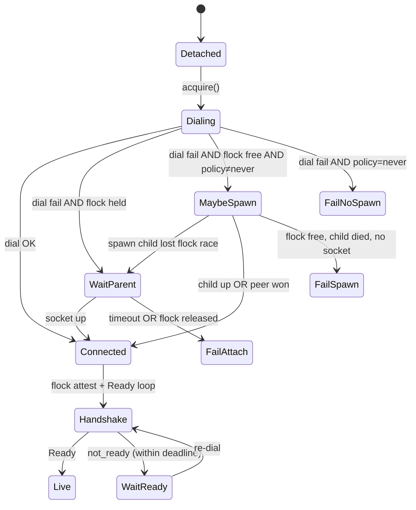

# Plan: Gateway runtime migration (attach → mux) with feature flags

**Type:** feat  
**Depth:** Standard  
**Status:** implementation-ready

---

## Summary

Migrate gateway-mode connection from **two independent `GatewayClient` unix peers** (fragile cold-start spawn, data resync tears down transport) to a **process-local `GatewayRuntime` + single drain/mux**, shipped behind feature flags. Nautilus keeps separate Data and Exec factories; they share one runtime underneath.

**Already landed (PR #40, branch `feat/gateway-attach-flock-rc4-2026-09-01`, merge before U1):** flock pre-check, `wait_for_parent_socket`, spawn mutex, attach path in `client.connect()`. U1 **extracts** that logic into `attach.py` + spawn policy — not greenfield attach work.

**Non-negotiable invariant:** one Rithmic credential → one `rithmic-gateway` parent → one Rithmic session. Python coordinates within a process; Rust flock is global authority.

---

## Problem frame

Gateway mode works but is operationally fragile:

| Failure mode | Root cause |
|--------------|------------|
| `SpawnError: credential flock held` | Dial fail treated as “no parent” → second `Popen` while manual/accessory parent alive |
| Data resync kills exec poll | `GatewayWireSession.reset_ticker()` = client `disconnect()+connect()` on a dedicated fd |
| Parallel cold start races | Data + Exec each `create_session()` → two spawns unless attach wins |
| History hydrate → transport recovery | RC2.3 `history_denied_live_md` conflated with connection failure; 30s timeout loops |
| No generation tracking | `connected=True` insufficient after parent restart |

Direct mode solved sharing via `_SESSION_CACHE` + refcount. Gateway mode deliberately avoided caching because two pollers on one byte stream is wrong — but **two sockets** couples lifecycle. Target: one socket, one reader, typed fan-out.

---

## Scope

### In

- Phase 1: attach coordinator, spawn policy, plant-level data recovery, typed terminal errors, generation metadata (no topology change).
- Phase 2: `GatewayRuntime` + `GatewayMux` behind `RITHMIC_GATEWAY_CLIENT_MODE=dual|mux`.
- Phase 3: mux default; remove dual-client path after soak.
- Tests for every state transition that caused Sep 2026 incidents.
- Ops-runbook + `.env.example` updates.
- Consumer note for `quant-guild-work` (`RITHMIC_GATEWAY_AUTO_SPAWN=0`, spawn policy).

### Out

- Merging Nautilus Data + Exec into one factory (NT architecture forbids).
- Raw “one `GatewayClient`, two `poll_*` callers” (B) — rejected.
- Execution lease / Kamal blue-green fencing (future; document as follow-up).
- Rust priority output queues (only if mux HOL blocking measured in production).
- `qgw_book` code changes beyond env/docs (consumer sets flags only).

### Deferred to follow-up work

- `acquire_exec_lease` / rolling-deploy fencing on gateway parent.
- Rust-side priority framing (exec before bulk MD).
- Full protocol `HELLO` capability negotiation across version skew (minimal generation fields in Phase 1 only).

---

## Requirements

| ID | Requirement |
|----|-------------|
| R1 | Dial fail + flock held must attach to existing parent (no `Popen`) within `spawn_timeout_sec` |
| R2 | Spawn only when flock free + spawn policy allows + spawn-election lock held |
| R3 | Data ticker resync must not call client `disconnect()` when runtime is shared |
| R4 | `history_denied_live_md` and similar terminal errors must not trigger transport reconnect |
| R5 | Data + Exec factories share one runtime in mux mode; independent facades |
| R6 | Feature flag `dual` preserves current behavior for rollback |
| R7 | Alpha consumer can run `spawn_policy=never` + `CLIENT_MODE=mux` with one manual parent |
| R8 | Transport reconnect (L3) must DISARM exec before reconcile; ticker reset (L0–L2) must not |

---

## High-level technical design

### Target topology

```
Rust rithmic-gateway (flock, ONE Rithmic login)
         │
    one unix fd / Python process  [mux mode]
         │
   GatewayRuntimeRegistry.acquire(fingerprint)
         │
   GatewayMux (single drain thread)
    ├── rpc: request_id → Future
    ├── md: queue → DataClient poll_event
    ├── exec: queue → ExecClient poll_order_event
    └── ctrl: generation / plant-state events
         │
    DataClient          ExecClient
    (NT factory)        (NT factory)
```

### Connect / attach state machine



**Spawn policy** (`RITHMIC_GATEWAY_SPAWN_POLICY`):

| Value | When |
|-------|------|
| `never` | Kamal accessory / manual `nohup` parent — dial-only |
| `if_missing` | **Default** when unset — local dev; spawn only after flock-free re-check |
| `always` | **Removed** — do not ship |

Maps to existing `RITHMIC_GATEWAY_AUTO_SPAWN=0` as alias for `never` (backward compat). `AUTO_SPAWN=1` maps to `if_missing`, not `always`.

### Data recovery escalation (mux-safe)

```
L0  replay local subscription intents
L1  logical resubscribe / refresh
L2  reset_ticker_plant RPC
L3  GatewayRuntime.reconnect()  → exec DISARM + reconcile
```

Phase 1 changes `GatewayWireSession.reset_ticker()` to prefer L2 before L3. In mux mode, L3 is runtime-owned only.

### Exec recovery (unchanged semantics, clearer generations)

```
DISARMED → RECONCILING → ARMED
```

Ticker reset (L0–L2) must not bump `armed_generation`. Transport reconnect (L3) must DISARM.

---

## Key technical decisions

| ID | Decision | Rationale |
|----|----------|-----------|
| KTD1 | Primary target = mux runtime (C), not shared `GatewayClient` (B) | One reader; typed channels; avoids poll interleaving bug |
| KTD2 | Keep two NT factories; share runtime underneath | NT adapter contract; session.py factory boundary unchanged |
| KTD3 | `RITHMIC_GATEWAY_CLIENT_MODE=dual\|mux` feature flag | Alpha solo consumer — safe rollback without dual maintenance forever |
| KTD4 | `spawn_policy=never` for production; `if_missing` for dev | Eliminates double-parent class; Kamal accessory owns parent |
| KTD5 | Phase 1 before Phase 2 | Attach + resync fixes stop bleeding without mux risk |
| KTD6 | (session-settled: user-directed — chosen over raw B: two pollers on one fd is fundamentally unsafe) | Oracle + code review consensus |

---

## Alternatives considered

| Option | Verdict |
|--------|---------|
| A — two clients + ops only | **Fallback** — keep if mux regresses; PR #40 is step toward A+ |
| B — one `GatewayClient`, two pollers | **Reject** — byte-stream ownership |
| C — mux runtime | **Primary** |
| D — merge NT factories | **Reject** — not feasible |

---

## Output structure (Phase 2+)

```text
python/rithmic_gateway/
  attach.py          # GatewayAttachCoordinator (extract from spawn/client)
  runtime.py         # GatewayRuntime, registry, refcount
  mux.py             # single drain, channels, RPC table
  client.py          # thin facade over runtime OR legacy dual path
python/rithmic_nt_connect/
  gateway_wire.py    # uses runtime.acquire() in mux mode
  config.py          # CLIENT_MODE, SPAWN_POLICY env
tests/
  test_gateway_attach.py
  test_gateway_runtime.py
  test_gateway_mux.py
```

---

## Implementation units

### U1. Extract attach coordinator + spawn policy

**Goal:** Refactor landed PR #40 attach logic into a coordinator; make Kamal/local spawn policy explicit.

**Requirements:** R1, R2, R7

**Dependencies:** PR #40 merged to `main`

**Files:**
- `python/rithmic_gateway/attach.py` (new)
- `python/rithmic_gateway/spawn.py`
- `python/rithmic_gateway/client.py`
- `python/rithmic_gateway/config.py`
- `python/rithmic_nt_connect/config.py`
- `tests/test_gateway_attach.py` (new)
- `tests/test_gateway_shared_consumers.py`
- `docs/references/ops-runbook.md`
- `.env.example`

**Approach:**
1. **Extract** (not reimplement) `wait_for_parent_socket`, flock pre-check, spawn-election lock from `spawn.py` / `client.py` into `GatewayAttachCoordinator.attach(config) → AttachedParent | SpawnedParent`.
2. Add `GatewayConfig.spawn_policy: never | if_missing` from `RITHMIC_GATEWAY_SPAWN_POLICY` (default `if_missing`); `RITHMIC_GATEWAY_AUTO_SPAWN=0` → `never`.
3. `client.connect()` and `spawn_gateway()` delegate to coordinator only.
4. Error taxonomy: `parent_flock_held_no_socket` vs `spawn_race_failed` vs `listen_path_mismatch`.

**Test scenarios:**
- Flock held, socket late → zero `Popen`, dial succeeds.
- Flock held, wrong listen path → `listen_path_mismatch` within timeout.
- `spawn_policy=never`, dial fail → immediate error, no `Popen`.
- Parallel `attach()` × 10 → ≤1 `Popen`, all succeed.
- `AUTO_SPAWN=0` sets `never` (backward compat).

**Verification:** `uv run pytest tests/test_gateway_attach.py tests/test_gateway_shared_consumers.py -q` green.

---

### U2. Plant-level data resync (stop client disconnect)

**Goal:** Data recovery must not tear down unix transport shared with exec.

**Requirements:** R3

**Dependencies:** U1

**Files:**
- `python/rithmic_nt_connect/gateway_wire.py`
- `python/rithmic_nt_connect/data.py`
- `tests/test_gateway_wire.py`
- `tests/test_data_client_unit.py` (mock resync path)

**Approach:**
1. Change `GatewayWireSession.reset_ticker()` to: replay subscriptions → `reset_ticker_plant()` RPC → only if that fails, client disconnect (**dual mode only**).
2. In mux mode (U4), `reset_ticker()` never disconnects runtime — runtime handles L2/L3.
3. Document L0–L3 escalation in `gateway_wire.py` docstring.

**Note:** L2 (`reset_ticker_plant`) ships in U2 for **both** dual and mux — dual mode gets the resync fix before mux lands.

**Test scenarios:**
- Resync calls `reset_ticker_plant`, not `disconnect`, when plant RPC succeeds.
- Resync failure in dual mode falls back to disconnect+connect.
- Exec poll loop unaffected across data resync (mock: no `disconnect` on shared client).

**Verification:** unit tests green; manual smoke with live gateway optional.

---

### U3. Typed terminal errors + generation metadata

**Goal:** Stop history/capability failures from entering generic reconnect; add epochs for recovery.

**Requirements:** R4

**Dependencies:** U1

**Files:**
- `python/rithmic_gateway/client.py`
- `proto/rithmic_gateway/v1/session.proto`
- `crates/rithmic-gateway/src/server/dispatch/history.rs` (error codes only if not already typed)
- `python/rithmic_nt_connect/data.py` (hydration path)
- `tests/test_rithmic_gateway_client.py`

**Approach:**
1. Map `history_denied_live_md` to `GatewayError("capability_denied", ...)` — no socket close, no spawn.
2. Add lightweight `gateway_instance_id` + `transport_generation` to `Ready` protobuf; surface on `GatewayClient` after handshake. Requires `scripts/gen_gateway_proto.py` regen + wheel rebuild.
3. `qgw_book` hydration fail-closed on empty lookback stays consumer-side; rithmic-connect only supplies typed errors.

**Test scenarios:**
- `history_denied_live_md` RPC returns immediately (<1s), socket stays open.
- After simulated parent restart, generation increments; client sees new id on re-handshake.

**Verification:** pytest unit tests; no new e2e required for alpha.

---

### U4. GatewayRuntime + GatewayMux (feature flag)

**Goal:** Single unix connection per process with typed fan-out; factories share runtime.

**Requirements:** R5, R6, R8

**Dependencies:** U1, U2, U3

**Files:**
- `python/rithmic_gateway/runtime.py` (new)
- `python/rithmic_gateway/mux.py` (new)
- `python/rithmic_nt_connect/session.py`
- `python/rithmic_nt_connect/gateway_wire.py`
- `python/rithmic_nt_connect/execution.py`
- `python/rithmic_nt_connect/config.py`
- `tests/test_gateway_runtime.py` (new)
- `tests/test_gateway_mux.py` (new)
- `tests/test_session_factory.py`

**Approach:**
1. `GatewayRuntimeRegistry.acquire(config) → GatewayRuntime` keyed by credential fingerprint + listen path.
2. Refcount: factory `create_session()` acquires; `disconnect()` releases fd only (not parent).
3. `GatewayMux` thread: read frames → RPC responses to waiters; events to md/exec queues by predicate.
4. `RITHMIC_GATEWAY_CLIENT_MODE=dual|mux` (default `dual` until U5).
5. `create_gateway_wire_session()` in mux mode returns facades sharing one runtime.
6. Update `session.py` gateway docstring + `test_gateway_create_session_returns_fresh_wire_session`: two **WireSession** facades always; one **runtime** underneath when mux.
7. `execution.py`: subscribe to `transport_generation` bumps → DISARM + reconcile path (R8).

**Test scenarios:**
- 10 concurrent `acquire()` → one socket connect.
- Interleaved MD + exec + RPC frames → each consumer receives only its events.
- Slow MD consumer does not block exec queue (bounded MD queue → explicit gap signal).
- `CLIENT_MODE=dual` → existing behavior unchanged (regression suite).
- Transport generation bump → exec facade observes DISARM signal; `execution.py` re-arm blocked until reconcile completes.

**Verification:** `uv run pytest tests/test_gateway_runtime.py tests/test_gateway_mux.py tests/test_gateway_shared_consumers.py tests/test_session_factory.py -q`

---

### U5. Default mux + delete dual path

**Goal:** Make mux the default; remove dual-client maintenance after soak.

**Requirements:** R6 (flip default)

**Dependencies:** U4 + alpha soak (1–2 weeks live RTH)

**Files:**
- `python/rithmic_nt_connect/config.py` (default `mux`)
- `python/rithmic_gateway/client.py` (remove dual-only branches or gate behind flag removal)
- `docs/references/ops-runbook.md`
- `docs/STATUS.md`
- `tests/test_session_factory.py`

**Approach:**
1. Default `CLIENT_MODE=mux`.
2. Keep `dual` flag one release for rollback.
3. After soak, delete dual code paths and flag.

**Test scenarios:**
- Default env creates shared runtime (no `CLIENT_MODE` set).
- `CLIENT_MODE=dual` still works until removal milestone.

**Verification:** full `uv run pytest -q` + `cargo test` green.

---

### U6. Consumer ops (quant-guild-work)

**Goal:** Sole alpha consumer runs correct flags against manual/Kamal parent.

**Requirements:** R7

**Dependencies:** U1 (spawn policy); rithmic-connect release/tag with U4+ merged

**Files (quant-guild-work repo):**
- `qgw_book/deploy/deploy.yml` (`RITHMIC_GATEWAY_AUTO_SPAWN=0` — may already be set)
- `qgw_book/deploy/RUNBOOK.md`
- `.env.example` (repo root)

**Approach:**
1. Document: `RITHMIC_GATEWAY_SPAWN_POLICY=never`, `RITHMIC_GATEWAY_CLIENT_MODE=mux` (after U4).
2. No qgw_book Python changes unless hydration needs generation-aware fail-closed (defer).

**Test scenarios:** Test expectation: none — ops/docs only.

**Verification:** Kamal deploy yaml lint; manual live restart checklist.

---

## Environment matrix (alpha)

| Surface | `SPAWN_POLICY` | `CLIENT_MODE` | Parent |
|---------|----------------|---------------|--------|
| Local dev | `if_missing` (default) | `dual` → `mux` after U4 | auto or manual |
| Live laptop | `never` | `mux` after U4 | manual `nohup` |
| Kamal VPS | `never` (`AUTO_SPAWN=0`) | `mux` after U4 | gateway accessory |

---

## Phased delivery

| Phase | Units | Ship criteria |
|-------|-------|---------------|
| **0 — Prereq** | Merge PR #40 | Attach path on `main` before U1 refactor |
| **1 — Harden attach** | U1, U2, U3 | Sep incident class gone; dual mode default |
| **2 — Mux behind flag** | U4 | All mux tests green; `CLIENT_MODE=mux` opt-in |
| **3 — Default + cleanup** | U5, U6 | Alpha soak clean; dual removed |

---

## Verification contract

- `uv run pytest tests/test_gateway_attach.py tests/test_gateway_shared_consumers.py tests/test_gateway_runtime.py tests/test_gateway_mux.py tests/test_session_factory.py tests/test_rithmic_gateway_client.py -q` — all green before merge each unit.
- `uv run pytest -q` — full Python suite green before U5.
- `cargo test -p rithmic-gateway -p rithmic-plants` — green when U3 touches Rust error surfaces.
- Manual alpha checklist (live RTH):
  1. Start parent: `RITHMIC_GATEWAY_IDLE_EXIT_SEC=-1 rithmic-gateway`
  2. Live with `SPAWN_POLICY=never`, `CLIENT_MODE=mux`
  3. Restart live without restarting parent → attach, no flock error
  4. Data channel error → resync without exec drop
  5. Hydration with live MD → `capability_denied`, not 30s spawn loop

---

## Definition of done

- [ ] Phase 1 merged; quant-guild-work live restart does not double-spawn
- [ ] Data resync does not call client `disconnect()` in mux mode
- [ ] `CLIENT_MODE=mux` passes full gateway test suite
- [ ] Ops-runbook documents spawn policy + client mode matrix
- [ ] Alpha soak (**≥10 RTH sessions** or **2 weeks** mux, whichever later) before U5 default flip

---

## Risks

| Risk | Mitigation |
|------|------------|
| HOL blocking on one stream | Bounded MD queue + gap signal; measure; Rust priority queues later |
| `reset_ticker_plant` disturbs all MD peers | Prefer L0/L1; dedupe concurrent resets |
| Kamal rolling deploy two exec actors | Document; exec lease deferred |
| Mux regression | `dual` flag rollback; Phase 1 valuable independent of mux |
| U4 scope (runtime + mux + exec DISARM) | Ship U4 only after U1–U3 green; keep `dual` default until soak |

---

## Sources & research

- Oracle session `rgw-arch-noattach` (2026-09-01) — mux primary, A+ fallback
- Sep 2026 incident: manual gateway + live auto-spawn → flock `SpawnError`
- PR #40: attach path partial implementation
- `python/rithmic_nt_connect/session.py` — gateway not cached by design
- `tests/test_session_factory.py::test_gateway_create_session_returns_fresh_wire_session`

---

## Open questions

| Question | Resolution |
|----------|------------|
| `gateway_instance_id` in protobuf vs process-start timestamp? | U3: minimal `Ready` extension + proto regen |
| Delete `dual` after how many alpha sessions? | **10 RTH sessions** or **2 calendar weeks** mux soak (whichever later) before U5 |
