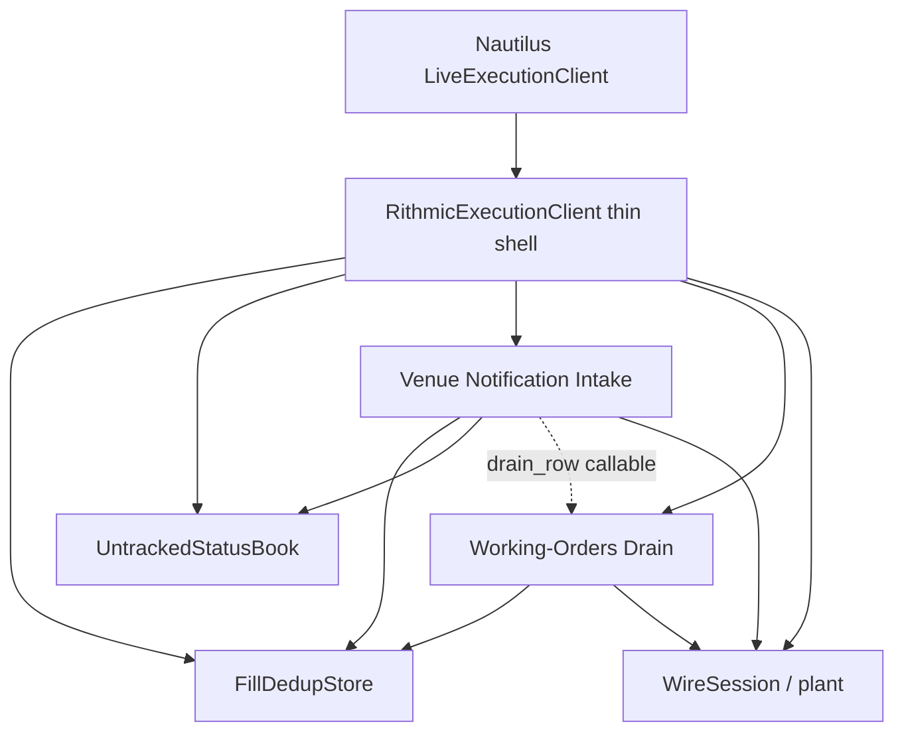
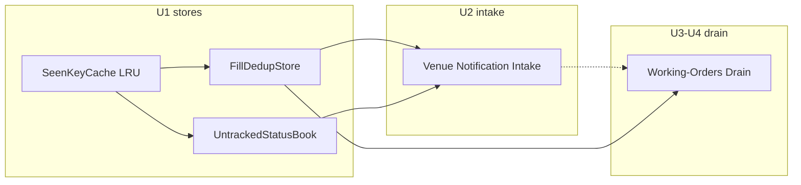

# Exec Drain Intake Stores - Plan

## Goal Capsule

- **Objective:** Deepen `RithmicExecutionClient` with three stacked modules — named fill/status stores, Venue Notification Intake, Working-Orders Drain — without changing Nautilus 1.231.x execution semantics.
- **Authority:** `Agents.md` + `docs/references/nautilus-adapter-conventions.md` (execution) override this plan on honesty rules; DI verdict in `docs/plans/2026-08-21-003-refactor-exec-classifiers-emit-guards-tdd-plan.md` stands (do not wrap cache/clock/msgbus/session).
- **Execution profile:** Green refactor; characterization-first before each move; thin client delegates preserve private method names tests already bind.
- **Stop when:** All units green under Verification Contract; public Nautilus `generate_*` / connect lifecycle signatures unchanged; no empty-drain, soft-mass, or fill-dedup regressions.
- **Tail:** Implementer owns cleanup of abandoned extract attempts before done.

---

## Product Contract

### Summary

One stacked refactor of the Python execution client: name the two `SeenKeyCache` jobs, extract Venue Notification Intake, then extract Working-Orders Drain — behavior-preserving.

### Problem Frame

`RithmicExecutionClient` still owns drain interpretation, notification routing, and two LRU jobs behind one shallow cache type. Recent extractions (`CommissionRegistry`, `PlantPoller`, `SeenKeyCache`) reduced size but left the densest honesty rules (empty drain, stale authority, soft mass-status, fill dedup, untracked suppress) spread across ~2900 LOC. Parallel fill vs status cache access already caused a churn regression; intake still shares `_drain_row_from_fields` with recon without a named owner.

### Requirements

**Stores**

- R1. Expose fill dedup as a presence store (`has_seen` / `mark` after successful publish) with LRU hit refresh.
- R2. Expose untracked status suppress as a last-published book (`get` / `record`) with LRU touch on suppress hits (`get` refreshes; identical value means do not republish).
- R3. Keep OrderedDict LRU as shared implementation detail; callers must not re-learn touch policy.

**Notification intake**

- R4. Route order notifications to tracked typed events or untracked reports only; never invent strategy ownership for untracked.
- R5. Preserve status-then-fill coupling: failed untracked status publish suppresses the fill phase.
- R6. Consume fill-dedup keys only after successful publish; unpriceable fills must not consume the key.
- R7. Preserve LAP-42 accepted guard, UPDATED terms fallback, and #3812 triggered guard behavior.

**Working-orders drain**

- R8. Own one raw-row iterator (normalize → basket → ts → interpret); no second interpreter for usable rows.
- R9. Preserve dual stale-authority: re-arm (`live_stream_authoritative=True`) vs bulk recon (`False`).
- R10. Empty best-effort drain must not mean “venue empty”; open_only empty returns `[]`; full recon raises `VenueQueryUnavailable`.
- R11. Soft mass-status soft-completes unavailable order/fill drains; never attaches fill reports; positions remain venue-qty authority including synthetic FLAT for cache-open ghosts.

**Compatibility**

- R12. Keep existing private method names that tests bind as thin delegates: `_handle_order_notification`, `_handle_untracked_notification`, `_publish_order_status_report`, `_publish_untracked_status`, `_publish_untracked_fill`, `_plant_poll_loop`, drain helpers (`_drain_row_from_fields`, `_iter_drain_rows`, `_latest_drain_rows`, `_row_stale_reason`, `_apply_drain_rows`), and `_fill_key_seen` / `_mark_fill_key`.
- R13. No Nautilus semantic change: pre-send deny / post-send unknown / tracked events vs untracked reports / plant latch contracts unchanged.

### Key Decisions

- **Caches → Intake → Drain sequencing** `(session-settled: user-directed — chosen over Drain-first: shared FillDedupStore must exist before intake and recon fills share it)`. Governs R1, R2, R6, R8.
- **One stacked plan covering all three deepenings** `(session-settled: user-directed — chosen over split Drain to a later PR: avoids half-migrated dual interpreters)`. Governs R8–R11.
- **Behavior-preserving green refactor only** `(session-settled: user-directed — chosen over semantic redesign: STATUS/conventions already define honesty)`. Governs R13.

### Success Criteria

- Focused suites that today pin drain/intake/dedup stay green without rewriting expected outcomes.
- New unit tests own store and collaborator seams; e2e remains the oracle for latch/re-arm/mass-status.
- `execution.py` shrinks by moving drain + intake bodies behind thin delegates (no new God collaborator).

### Scope Boundaries

**In scope**

- `FillDedupStore` / `UntrackedStatusBook` (or equivalent names) over internal LRU
- Venue Notification Intake collaborator
- Working-Orders Drain collaborator (interpret / latest / stale / apply / report lists / soft mass-status policy)
- Fixture updates so tests inject the new stores/collaborators
- Characterization tests for churn suppress and existing recon/intake cases

**Out of scope**

- CommissionRegistry property-shim cleanup
- Submit / modify / cancel / bracket command-path extract
- `data.py` bar/ticker registry or MD poll loops
- Wrapping Nautilus cache/clock/msgbus/session (plan 003 DI verdict)
- Abstracting `generate_*` emitters behind interfaces

#### Deferred to Follow-Up Work

- Commission shim deletion (architecture review candidate 4)
- Order command-path deepening (candidate 5)
- Market-data `BarSubscriptionRegistry` / poller unification

### Sources

- Architecture review: temp HTML `architecture-review-20260914192441.html` (session)
- `HANDOFF_PYTHON_ARCHITECTURE.md` (next collaborators)
- `docs/plans/2026-08-21-003-refactor-exec-classifiers-emit-guards-tdd-plan.md` (DI + signature freeze)
- `docs/STATUS.md` capability notes (empty drain, soft mass-status, fill dedup)
- `Agents.md` verify commands

---

## Planning Contract

### Key Technical Decisions

- KTD1. **Shared fill-dedup seam across live + recon** — client constructs and holds one `FillDedupStore` (and `UntrackedStatusBook`); pass the same store instances into intake and drain. Rationale: STATUS already requires live/recon share the adapter-wide dedup store; splitting would reintroduce double fills.
- KTD2. **One drain-row interpreter** — `_drain_row_from_fields` (or successor) lives on Working-Orders Drain; intake receives it as a callable/adapter for untracked status build. Rationale: research showed intake↔drain coupling; duplicating interpreters violates R8.
- KTD3. **Thin client delegates, not public API rewrite** — Nautilus overrides stay on `RithmicExecutionClient`; extracted modules sit behind existing private method names. Rationale: `_bind_untracked_methods` and unbound `RithmicExecutionClient._handle_*` calls in `tests/test_exec_recon.py`.
- KTD4. **Mirror `PlantPoller` / `CommissionRegistry` packaging** — new modules under `python/rithmic_nt_connect/` with dedicated unit tests; client holds instances. Rationale: established extraction pattern; avoid inventing a second style.
- KTD5. **Retire shallow `VenueNotification` usage as intake lands** — fold `is_benign_bare_complete` into intake (or keep module-level pure function); do not grow unused property wrappers. Rationale: deletion test already failed for the VO.
- KTD6. **Keep `SeenKeyCache` as internal LRU helper or inline into the two stores** — do not leave dual public types (`SeenKeyCache` + domain stores) for the same jobs. Rationale: R3.

### High-Level Technical Design

### Assumptions

- Existing `tests/test_exec_recon.py` / `tests/test_exec_transport_e2e.py` remain valid oracles; fixture injection updates are mechanical.
- Module file names (`recon.py`, `notification_intake.py`, or handoff names) may be chosen at implement time if they stay under `python/rithmic_nt_connect/` and match KTD4.

### Sequencing

1. U1 stores → 2. U2 intake → 3. U3 drain core → 4. U4 recon reports + soft mass-status → 5. U5 verify/shrink pass

---

## Implementation Units

### U1. Named fill and status stores

- **Goal:** Replace dual `SeenKeyCache` call sites with domain stores whose interfaces encode touch policy.
- **Requirements:** R1, R2, R3, R6, R12
- **Dependencies:** none
- **Files:**
  - modify `python/rithmic_nt_connect/_orders.py` (or new small module next to it)
  - modify `python/rithmic_nt_connect/execution.py` (construct + thin `_fill_key_seen` / `_mark_fill_key` / untracked get-mark)
  - modify `tests/test_domain_value_objects.py`
  - modify `tests/test_exec_recon.py`, `tests/test_exec_transport_e2e.py` fixtures
- **Approach:**
  1. Add `FillDedupStore` (`has_seen`/`mark`) and `UntrackedStatusBook` (`get`/`record`) over internal LRU.
  2. Point client fields at the new types; remove public reliance on `SeenKeyCache` for these jobs (KTD6).
  3. Keep churn regression (`test_untracked_status_hot_key_survives_cache_churn`) green via book touch-on-read.
- **Execution note:** Characterization-first — extend store unit tests before swapping client fields.
- **Patterns to follow:** Current `SeenKeyCache` touch-on-hit semantics; fixture injection style from recent SeenKeyCache migration.
- **Test scenarios:**
  - Fill store: mark after publish; second `seen` true; hit refreshes so churn does not drop a hot key.
  - Status book: `record` status key; identical re-push `get` equals recorded value (suppress) and refreshes; changed terms `get` differs (republish then `record`).
  - Eviction: with small `max_size`, untouched key evicts; touched suppress key survives intervening unique ids.
- **Verification:** Domain + recon untracked/churn tests green; client no longer types these fields as raw `SeenKeyCache` for the two jobs.

### U2. Venue Notification Intake collaborator

- **Goal:** Move tracked/untracked notification routing and fill/status publish behind one intake module; client methods become thin delegates.
- **Requirements:** R4, R5, R6, R7, R12, R13
- **Dependencies:** U1
- **Files:**
  - create `python/rithmic_nt_connect/notification_intake.py` (name flexible per Assumptions)
  - modify `python/rithmic_nt_connect/execution.py`
  - create/extend `tests/test_notification_intake.py` (or equivalent)
  - modify `tests/test_exec_recon.py` binding helpers as needed
- **Approach:**
  1. Extract `_handle_order_notification` / untracked status+fill / tracked fill emit path into intake. Intake may hold Nautilus cache/clock by reference (not wrapped) plus emit/publish callables, the shared stores from U1, and a drain-row callable (KTD2 — may temporarily call the client method until U3).
  2. Preserve thin client delegates for `_handle_*` and the `_publish_untracked_*` / `_publish_order_status_report` names `_bind_untracked_methods` binds (KTD3, R12).
  3. Fold or relocate `is_benign_bare_complete` (KTD5); stop growing unused `VenueNotification` surface.
- **Execution note:** Keep status-failure-suppresses-fill test red/green before moving the coupling.
- **Patterns to follow:** `PlantPoller` callback injection; plan 003 emit-guard methods stay reachable for spies.
- **Test scenarios:**
  - Tracked accepted only when SUBMITTED (LAP-42).
  - Untracked unchanged re-push suppressed; changed quantity republishes.
  - Untracked status publish failure → no fill report (R5).
  - Tracked/untracked fill: duplicate venue trade id skipped; first publish marks store.
  - Unpriceable tracked fill does not mark dedup key.
- **Verification:** `tests/test_exec_recon.py` untracked/tracked notification tests + new intake unit tests green.

### U3. Working-Orders Drain core

- **Goal:** Own interpret / iterate / latest / stale / apply-drain behind one drain module; single iterator remains the only raw-row pipeline.
- **Requirements:** R8, R9, R12, R13
- **Dependencies:** U1; U2 may still pass a temporary client drain-row callable until this unit lands the owner
- **Files:**
  - create `python/rithmic_nt_connect/recon.py` (or `working_orders_drain.py`)
  - modify `python/rithmic_nt_connect/execution.py`
  - create/extend `tests/test_working_orders_drain.py` (or fold into recon tests)
  - modify `tests/test_exec_transport_e2e.py` as needed for re-arm apply path
- **Approach:**
  1. Move `_drain_row_from_fields`, `_iter_drain_rows`, `_latest_drain_rows`, `_row_stale_reason`, `_apply_drain_rows` (+ helpers they exclusively own).
  2. Wire intake to the drain’s row interpreter (finish KTD2).
  3. Client re-arm / reconnect paths call drain.apply; keep method names as delegates where tests require.
- **Execution note:** Characterization coverage for stale-authority both modes before the move.
- **Patterns to follow:** STATUS “one owned iterator”; comments explaining *why* re-arm vs bulk differ must move with the code.
- **Test scenarios:**
  - Malformed/missing basket rows skipped; trustworthy bindable vs advisory-only distinguished.
  - Latest per basket prefers higher `ts_event`; equal ts keeps last-arrived.
  - `live_stream_authoritative=True`: closed local order → all rows stale; older-than-`ts_last` stale; `ts_event==0` not stale-skipped.
  - `live_stream_authoritative=False`: non-terminal snapshot for locally closed suppressed; terminal-vs-terminal still forwards.
  - Apply publishes status before bind; publish failure aborts barrier (no bind).
- **Verification:** Re-arm / drain e2e + recon stale tests green.

### U4. Recon reports and soft mass-status on drain

- **Goal:** Move order/fill report assembly and soft mass-status policy onto the drain module; client `generate_*` stay thin Nautilus overrides.
- **Requirements:** R10, R11, R12, R13
- **Dependencies:** U3, U1
- **Files:**
  - modify drain module from U3
  - modify `python/rithmic_nt_connect/execution.py` (`generate_order_status_reports`, `generate_fill_reports`, `generate_mass_status`, helpers)
  - modify `tests/test_exec_recon.py` mass-status / empty-drain cases
- **Approach:**
  1. Drain constructor takes: load_orders callable, cache/order-lookup callables, publish/bind callables, shared `FillDedupStore` (KTD1). Drain builds status/fill report lists.
  2. Soft mass-status split: client keeps `generate_mass_status` try/soft-complete orchestration (Nautilus override); drain owns empty-drain semantics and report-list builders (omit fills; FLAT augment helpers; lookback window helper when available). Do not re-open-code honesty rules on the client.
  3. Read-only / `enable_trading=False` branches stay on the client override; drain helpers they call keep the same semantics.
  4. Preserve thin delegates for helpers tests still bind (`_load_orders_events`, `_apply_mass_status_report_window`, `_order_status_report_from_fields`, etc.) per R12.
- **Execution note:** Pin soft mass-status “never attach fills” before moving the body.
- **Patterns to follow:** Existing MY043 soft-complete tests in `test_exec_recon.py`.
- **Test scenarios:**
  - Full recon empty drain → `VenueQueryUnavailable`; open_only empty → `[]`.
  - Soft mass-status when order drain unavailable still returns mass status with positions; orders cleared when soft-failed.
  - Soft mass-status never includes fill reports even if fill drain returned rows.
  - Fill recon skips already-seen dedup keys shared with live path.
  - Fill recon publishes status prerequisite before fill when needed.
- **Verification:** Mass-status + empty-drain + fill recon tests green.

### U5. Shrink pass and signature freeze check

- **Goal:** Confirm delegates are thin, remove dead shallow wrappers, and run the full focused verification gate.
- **Requirements:** R12, R13
- **Dependencies:** U1–U4
- **Files:**
  - modify `python/rithmic_nt_connect/execution.py` (dead code / unused imports)
  - optionally update `HANDOFF_PYTHON_ARCHITECTURE.md` next-steps marks (docs only if already touching handoff)
  - tests already covered by prior units
- **Approach:**
  1. Grep for residual `SeenKeyCache` dual-job usage and unused `VenueNotification` surface; delete or narrow.
  2. Confirm frozen signatures still exist as delegates.
  3. Run Verification Contract commands.
- **Test expectation:** none beyond re-running existing suites — no new behavior.
- **Verification:** Verification Contract all applicable rows pass; `execution.py` no longer contains the moved drain/intake bodies inline.

---

## Verification Contract

| Gate | Command / check | Applies |
| --- | --- | --- |
| Store + intake + drain unit/recon | `uv run pytest -q tests/test_domain_value_objects.py tests/test_exec_recon.py tests/test_exec_transport_e2e.py` (+ new unit files) | every unit |
| Typecheck | `uv run ty check python/rithmic_nt_connect tests` | after U2+ |
| Lint/format | `uv run ruff check .` and `uv run ruff format --check .` | before done |
| Full pytest | `uv run pytest -q` | U5 / Definition of Done |
| STATUS rollup | `python scripts/status_progress.py --check` | if STATUS/handoff touched |

---

## Definition of Done

- U1–U5 complete; frozen private method names still callable as today.
- No intentional behavior change in empty-drain, soft mass-status, fill dedup, untracked suppress, or plant re-arm paths.
- Abandoned extract branches removed from the diff.
- Focused suites + full `uv run pytest -q` green.

---

## Risks & Dependencies

| Risk | Mitigation |
| --- | --- |
| Dual drain-row interpreters during U2→U3 window | KTD2; U2 uses one callable; U3 owns it; no copy-paste of trustworthy rules |
| Soft mass-status accidentally attaches fills after move | Characterization test before move; R11 |
| Fixture stubs miss new store types | Update `_trading_client` / `_bind_untracked_methods` in same unit as the swap |
| Plan 003 DI relitigation | Explicit non-goal; collaborators may take Nautilus cache/clock by reference (do not wrap/re-abstract them); prefer PlantPoller-style callables for emit/publish/load seams |
| HANDOFF listed Drain before Intake | Session settled caches→intake→drain; note in Sources |

---

## Alternative Approaches Considered

- **Drain-first sequencing** — higher early locality, but temporary dual fill-dedup wiring; rejected (session-settled).
- **Intake+caches only; defer Drain** — smaller plan, leaves densest semantics in the client; rejected (session-settled one stacked plan).
- **New DI wrappers around cache/clock** — conflicts with plan 003; rejected.
